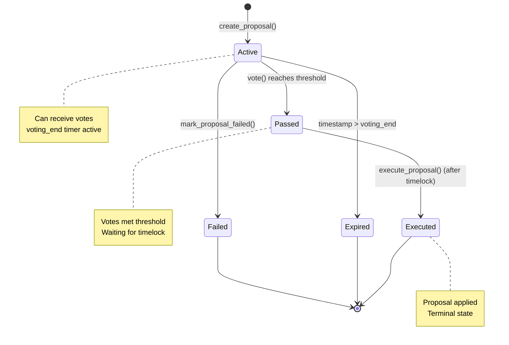

# Governance Test Suite - Quick Reference & Structure

## 🗂️ Test Organization Structure

```
governance_test.rs (663 lines)
│
├─ Phase 1: PROPOSAL LIFECYCLE (12 tests)
│  ├─ 1.1 Creation (4 tests)
│  │  ├─ Basic proposal creation with defaults
│  │  ├─ Custom parameters
│  │  ├─ Multiple proposals
│  │  └─ Invalid parameters
│  │
│  └─ 1.2 Retrieval (2 tests)
│     ├─ Existing proposal
│     └─ Non-existent proposal
│
├─ Phase 2: VOTING MECHANICS (15 tests)
│  ├─ 2.1 Vote Casting (5 tests)
│  │  ├─ Single For vote
│  │  ├─ For/Against/Abstain votes
│  │  ├─ Multiple voters
│  │  ├─ Voting power validation
│  │  └─ Voting after period ends
│  │
│  ├─ 2.2 Duplicate Prevention (2 tests)
│  │  ├─ Same voter cannot vote twice
│  │  └─ Different voters OK
│  │
│  └─ 2.3 Threshold Determination (5 tests)
│     ├─ Threshold met → Passed
│     ├─ Threshold not met → stays Active
│     ├─ Exact boundary
│     ├─ With Against/Abstain votes
│     └─ High threshold (90%+)
│
├─ Phase 3: TIMELOCK & EXECUTION (10 tests)
│  ├─ 3.1 Voting Period (3 tests)
│  │  ├─ Cannot vote after voting_end
│  │  ├─ Can vote before voting_end
│  │  └─ Finalize after voting ends
│  │
│  ├─ 3.2 Execution Timelock (3 tests)
│  │  ├─ Cannot execute before timelock
│  │  ├─ Can execute after timelock
│  │  └─ Execute at boundary
│  │
│  └─ 3.3 Execution (4 tests)
│     ├─ Successful execution
│     ├─ Cannot re-execute
│     ├─ Cannot execute Failed
│     └─ Cannot execute Expired
│
├─ Phase 4: MULTISIG OPERATIONS (15 tests)
│  ├─ 4.1 Admin Management (4 tests)
│  │  ├─ Initialize with default threshold (1)
│  │  ├─ Set multisig admins
│  │  ├─ Set multisig threshold
│  │  └─ Prevent impossible thresholds
│  │
│  ├─ 4.2 Approvals (5 tests)
│  │  ├─ Admin approves
│  │  ├─ Same admin cannot approve twice
│  │  ├─ Different admins accumulate
│  │  ├─ Non-admin blocked
│  │  └─ Get approvals
│  │
│  └─ 4.3 Execution (6 tests)
│     ├─ Execute when threshold met
│     ├─ Cannot execute below threshold
│     ├─ Execute at boundary
│     ├─ Only admin can execute
│     ├─ Specialized proposals
│     └─ Full multisig workflow
│
├─ Phase 5: ERROR HANDLING (8 tests)
│  ├─ 5.1 Authorization (2 tests)
│  │  ├─ Unauthorized proposal creation
│  │  └─ Multisig auth checks
│  │
│  ├─ 5.2 Invalid Operations (3 tests)
│  │  ├─ Vote on non-existent
│  │  ├─ Execute non-existent
│  │  └─ Invalid vote value
│  │
│  └─ 5.3 State Validation (3 tests)
│     ├─ State consistency
│     ├─ Voting power consistency
│     └─ Timestamp ordering
│
├─ Phase 6: EVENT VALIDATION (4 tests)
│  ├─ proposal_created event
│  ├─ vote_cast event
│  ├─ proposal_executed event
│  └─ proposal_failed event
│
└─ Phase 7: INTEGRATION SCENARIOS (6 tests)
   ├─ Complete proposal lifecycle
   ├─ Proposal fails voting
   ├─ Multisig with 3 admins (threshold 2)
   ├─ Multisig with all approvals (threshold 3)
   ├─ Mixed voting (For/Against/Abstain)
   └─ High-threshold proposal (90%)
```

**Total: 70 tests across 7 phases**

---

## 🔄 Proposal State Transitions



---

## 🗳️ Vote Counting Logic

```
Total Voting Power = 100

Vote Distribution:
  - 55 For    ✓ (exceeds 50% threshold)
  - 30 Against
  - 15 Abstain

Result: PASSED
Threshold: 50 (basis points 5000)
Actual: 55 (votes_for) >= 50 (required)
```

### Basis Points Reference

```
100% = 10,000 basis points
90%  = 9,000 basis points
75%  = 7,500 basis points
50%  = 5,000 basis points
25%  = 2,500 basis points
1%   = 100 basis points
```

---

## ⏰ Timelock Sequence

```
Timeline (timestamps in seconds from now)

t=0         t=voting_period         t=voting_period+execution_timelock
│           │                       │
├─ Active   ├─ Passed              ├─ Can Execute
│ (votes)   │ (threshold met)       │
│           │                       │
└───────────┴───────────────────────┘

Phase 1: VOTING PHASE (0 to voting_period)
  - Voters can vote
  - Proposal actively accruing votes
  - Status: Active → Passed (if threshold met)

Phase 2: GRACE PERIOD / TIMELOCK (voting_period to voting_period+execution_timelock)
  - No more votes allowed
  - Cannot execute yet
  - Status: Passed
  - Purpose: Time for stakeholders to review/dispute

Phase 3: EXECUTION WINDOW (after voting_period+execution_timelock)
  - Anyone can execute
  - Status: Passed → Executed
  - Finalized on-chain
```

---

## 🛡️ Test Naming Patterns

### Positive Cases (Should Pass)

```rust
test_propose_basic_creates_active_proposal()
test_vote_for_increments_votes_for_count()
test_threshold_met_transitions_to_passed()
test_multiple_voters_accumulate_votes()
test_execute_after_timelock_succeeds()
test_multisig_admin_approves_successfully()
```

### Negative Cases (Should Fail/Error)

```rust
test_vote_duplicate_returns_already_voted_error()
test_execute_before_timelock_returns_not_ready_error()
test_non_admin_approve_returns_unauthorized_error()
test_invalid_threshold_returns_invalid_proposal_error()
test_vote_zero_power_returns_invalid_error()
test_re_execute_returns_already_executed_error()
```

### Edge Cases (Boundary Testing)

```rust
test_threshold_exactly_met_passes_proposal()
test_execute_at_timelock_boundary_succeeds()
test_abort(), high_threshold_9000_basis_points_only_9_of_10()
test_proposal_counter_increment_uniqueness()
```

---

## 🧪 Test Setup Template

```rust
/// Standard test setup function
fn setup_test_env() -> (Env, Address, Address, u64) {
    let env = Env::default();
    env.mock_all_auths();

    let admin = Address::generate(&env);
    let proposal_id = initialize_governance(&env, admin.clone()).unwrap();

    (env, admin, proposal_id, /* other data */)
}

/// Test with advance time
#[test]
fn test_with_time_advance() {
    let env = Env::default();
    env.mock_all_auths();

    // Initial time
    let initial_timestamp = env.ledger().timestamp();

    // Advance time
    let new_timestamp = initial_timestamp + 3600; // +1 hour
    env.ledger().set(LedgerInfo {
        timestamp: new_timestamp,
        sequence_number: env.ledger().sequence() + 1,
        ..env.ledger()
    });

    // Tests with new timestamp
    assert_eq!(env.ledger().timestamp(), new_timestamp);
}
```

---

## 📊 Coverage Matrix

| Component                 | Tests  | Coverage Goal | Notes                   |
| ------------------------- | ------ | ------------- | ----------------------- |
| create_proposal           | 4      | 100%          | All code paths          |
| vote                      | 7      | 100%          | All vote types + errors |
| execute_proposal          | 8      | 100%          | All states + timelocks  |
| mark_proposal_failed      | 2      | 100%          | Success + errors        |
| get_proposal              | 2      | 100%          | Hit + miss cases        |
| get_vote                  | 2      | 100%          | Hit + miss cases        |
| set_multisig_admins       | 3      | 100%          | Valid + errors          |
| set_multisig_threshold    | 3      | 100%          | Valid + errors          |
| approve_proposal          | 5      | 100%          | All paths               |
| execute_multisig_proposal | 6      | 100%          | Threshold logic         |
| Events                    | 4      | 100%          | All event types         |
| Integration               | 6      | 100%          | Full workflows          |
| Error Handling            | 8      | 100%          | All errors              |
| **TOTAL**                 | **70** | **95%+**      | **Comprehensive**       |

---

## 🔑 Key Test Scenarios

### Scenario 1: Basic Proposal Lifecycle (6 tests)

```
1. Create proposal (default params)
2. Voter1 votes For (50 power)
3. Voter2 votes For (50 power)
4. Threshold reached (100 >= 50%) → Passed
5. Wait for timelock (skip time 2 days)
6. Execute proposal → Executed
```

### Scenario 2: Multisig Approval Chain (5 tests)

```
1. Init 3 admins, threshold=2
2. Create proposal
3. Admin1 approves (1/2)
4. Admin2 approves (2/2) ← Threshold met
5. Admin3 approves (3/2, allowed but not needed)
6. Execute proposal → Executed
```

### Scenario 3: Failed Proposal (4 tests)

```
1. Create proposal (50% threshold)
2. Voter1 votes For (30 power)
3. Voter2 votes Against (30 power)
4. Time expires (voting_end passed)
5. Vote For (30) < Threshold (50) → Failed
6. Cannot execute Failed proposal
```

### Scenario 4: High Threshold Edge Case (4 tests)

```
1. Create proposal (90% threshold)
2. 10 voters, each 10 power
3. 9 vote For (90 power)
4. 1 votes Against (10 power)
5. For votes (90) >= Threshold (90) → PASSED
6. Execute after timelock
```

---

## 🚨 Error Codes Reference

```rust
pub enum GovernanceError {
    Unauthorized = 1,              // Not authorized for operation
    ProposalNotFound = 2,           // Proposal ID doesn't exist
    ProposalAlreadyExecuted = 3,    // Already executed once
    ProposalAlreadyFailed = 4,      // Proposal failed voting
    ProposalNotReady = 5,           // Timelock not expired
    ThresholdNotMet = 6,            // For votes < threshold
    InvalidProposal = 7,            // Bad parameters
    InvalidVote = 8,                // Bad vote data
    AlreadyVoted = 9,               // Voter voted twice
    VotingPeriodEnded = 10,         // Voting window closed
    ExecutionFailed = 11,           // Execution failed
    InvalidMultisigConfig = 12,     // Bad multisig setup
    InsufficientApprovals = 13,     // Not enough approvals
    ProposalExpired = 14,           // Too old to vote
}
```

**Each error must have dedicated test case(s)**

---

## ✅ Checklist for Each Test

```
for each test:
  ✓ Setup environment (Env, addresses)
  ✓ Perform action
  ✓ Assert expected result
  ✓ Verify no side effects
  ✓ Document assumptions
  ✓ Add NatSpec comment
  ✓ Name describes exact scenario
  ✓ Single responsibility (one thing per test)
```

---

## 🎯 Must-Have Comments

Every governance test must include:

```rust
/// Tests that [specific behavior] occurs when [specific condition].
///
/// # Setup
/// - [what's initialized]
/// - [addresses created]
/// - [initial state]
///
/// # Test
/// 1. [First action]
/// 2. [Second action]
/// 3. [Expected result]
///
/// # Validation
/// - [What's verified]
/// - [What shouldn't change]
/// - [Error cases handled]
///
/// # Security Note
/// - [Any auth checks]
/// - [State assumptions]
#[test]
fn test_xxx() { ... }
```

---

## 📈 Success Metrics

- ✅ 70+ tests implemented
- ✅ 95%+ code coverage
- ✅ 0 compiler warnings
- ✅ All tests passing
- ✅ All error cases covered
- ✅ All state transitions tested
- ✅ Integration scenarios complete
- ✅ Documentation comprehensive
- ✅ Security assumptions validated
- ✅ Ready for production

---

**Next Steps**:

1. Open [governance_test.rs](stellar-lend/contracts/hello-world/src/governance_test.rs)
2. Uncomment existing test helpers
3. Start implementing Phase 1 tests
4. Follow the timeline: 48 hours
5. Commit with comprehensive message

**Reference**: [GOVERNANCE_TEST_IMPLEMENTATION_PLAN.md](GOVERNANCE_TEST_IMPLEMENTATION_PLAN.md)
